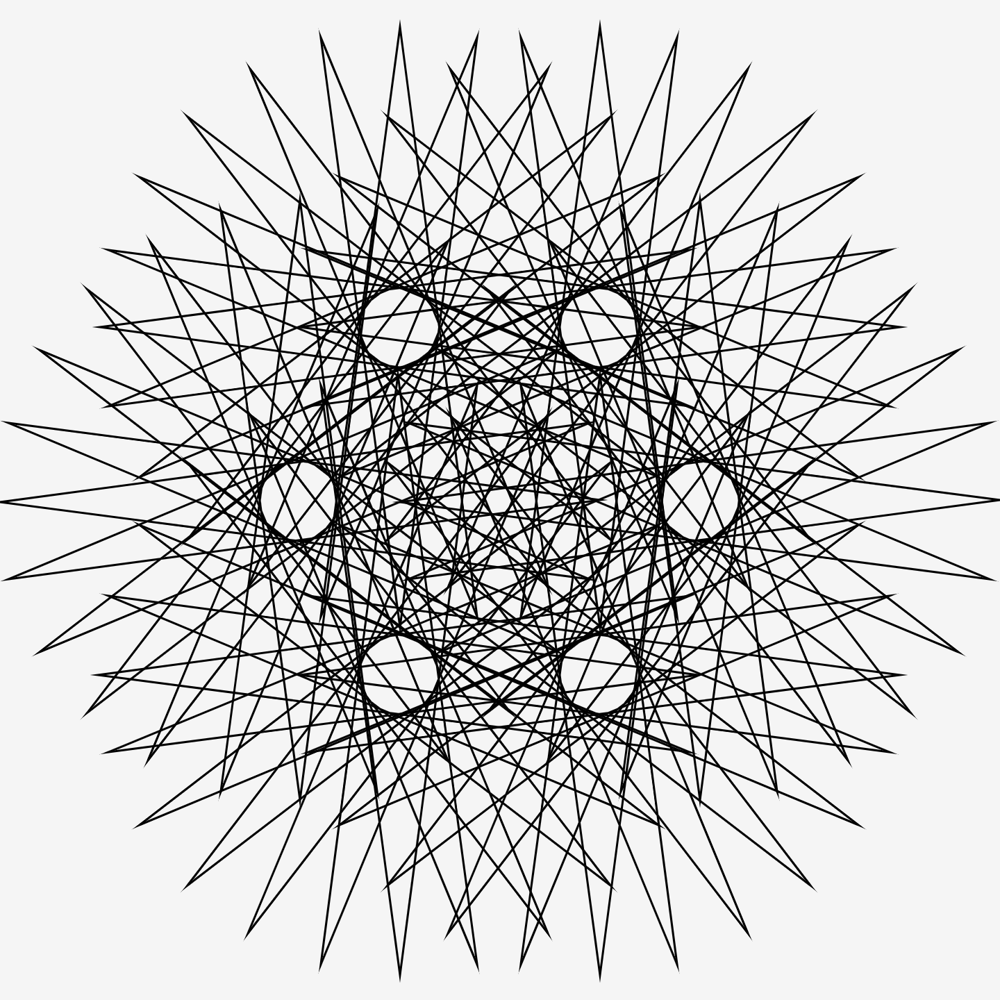
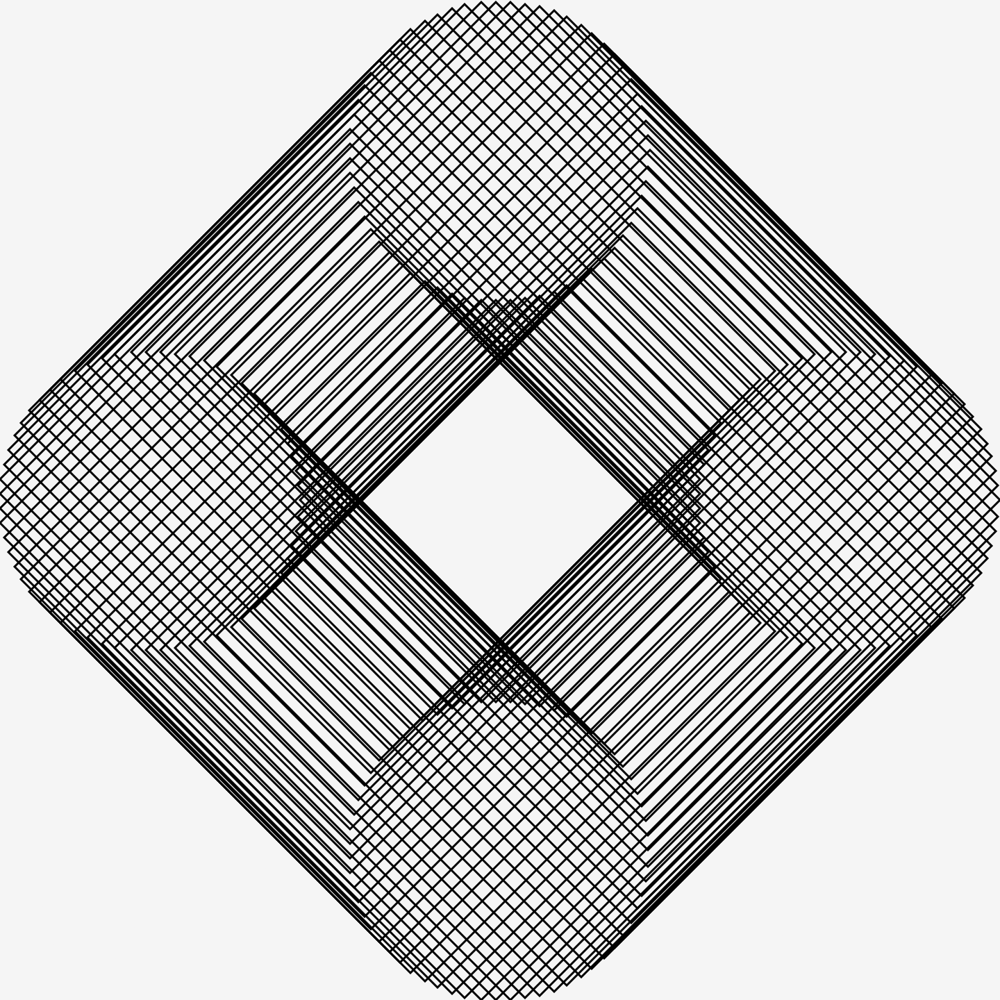
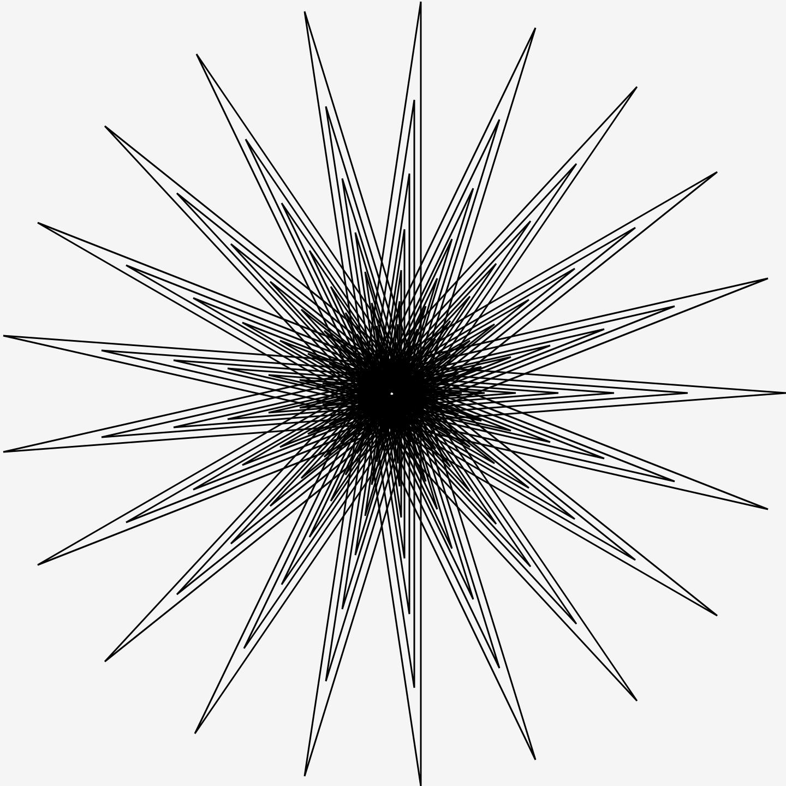
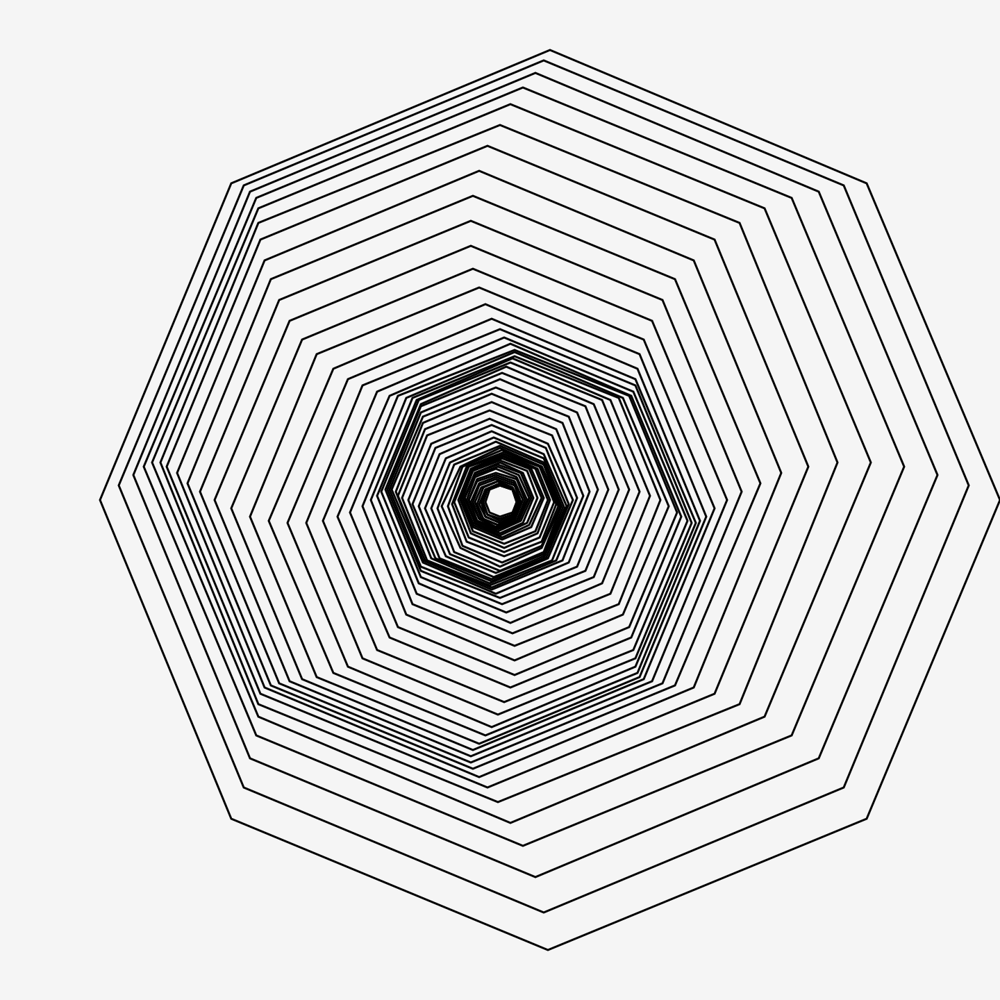
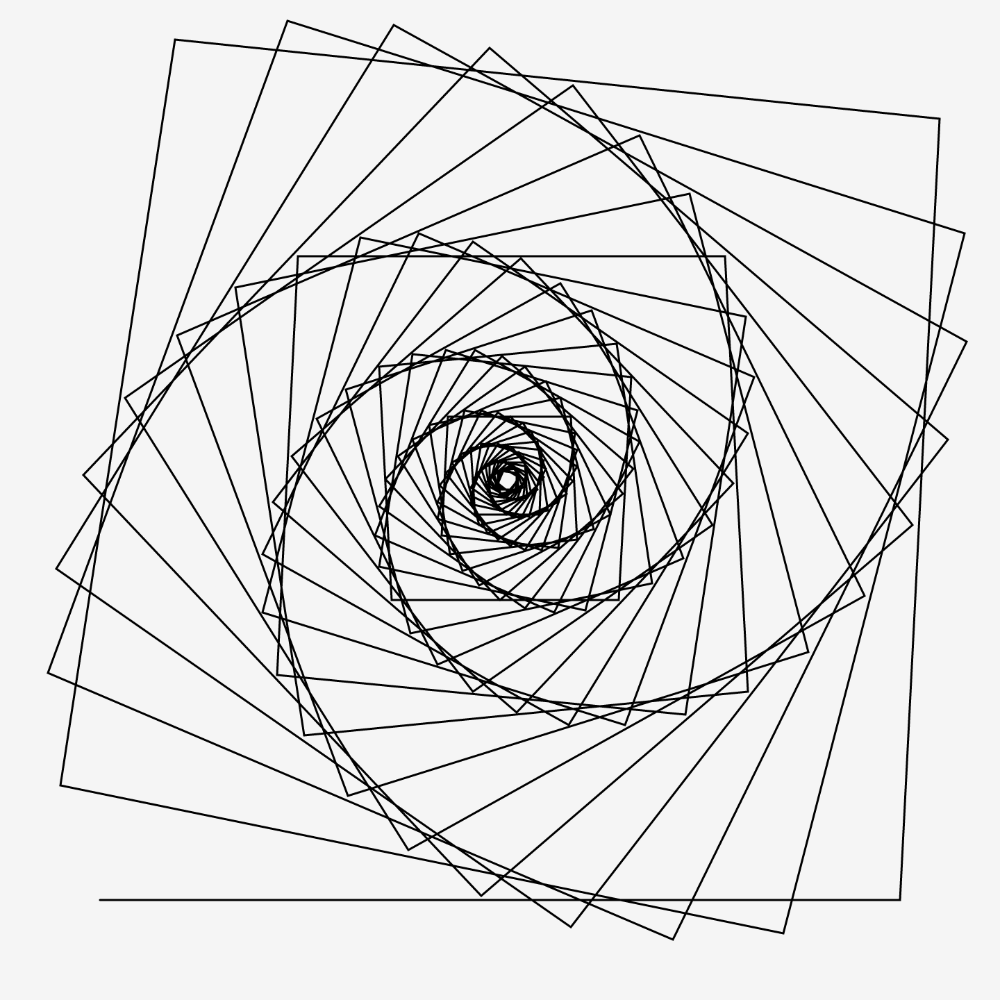
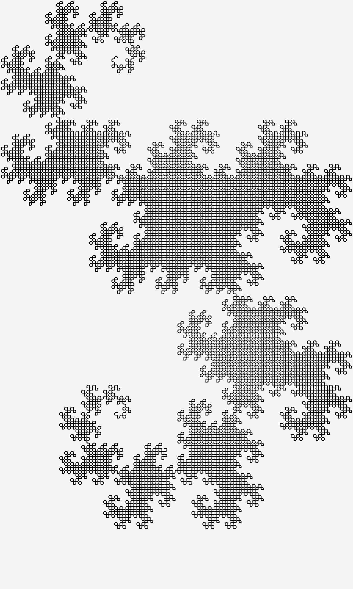
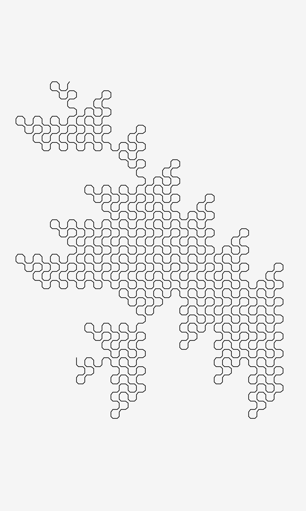

# Dessins géométriques et artistiques avec votre micro-ordinateur
## 1. Polygones, étoiles, etc.
### Le programme POLYGONES RÉGULIERS

### Le programme ÉTOILES RÉGULIÈRES

### Le programme COMPOSITION 1

### Le programme COMPOSITION 2

### Le programme JOLIGONES

## 2. Dessins à partir de données

## 3. Dragons de papiers pliés

## 4. Étoiles fractales

